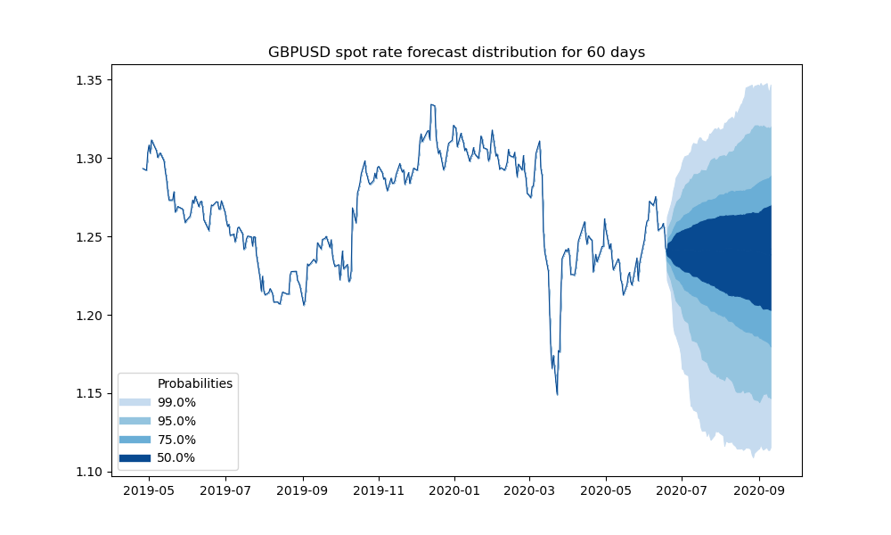
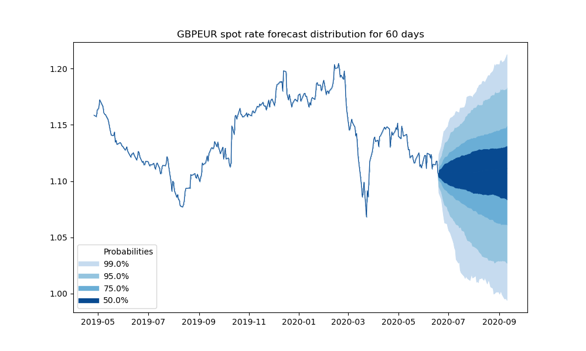

# TimeSeriesFanCharting
Time Series Fan Charts of Spot FX Rates

The prediction of time series whether economic or market based is typically a very difficult task and often practictioners look at the likely distribution of a forecast and confidence intervals associated with this rather than trying to predict a specific value.

This Python example is a simple model considering GBPUSD and GBPEUR daily spot rate time series over the last 10 years and predicting the path over the next 60 days.  By looking at the percentage changes in the time series over the different intervals, we can then consider percentiles to infer the probabilities of the future path based on the historical data and then construct the fan chart.

From looking at the GBPEUR case below, we can therefore consider that over the next 60 days, we are 99% confident that the pound will not depreciate any lower than 1.11, and 75% of the time we would expect this to remain higher than 1.17.  

Underlying data source, https://www.bankofengland.co.uk/

